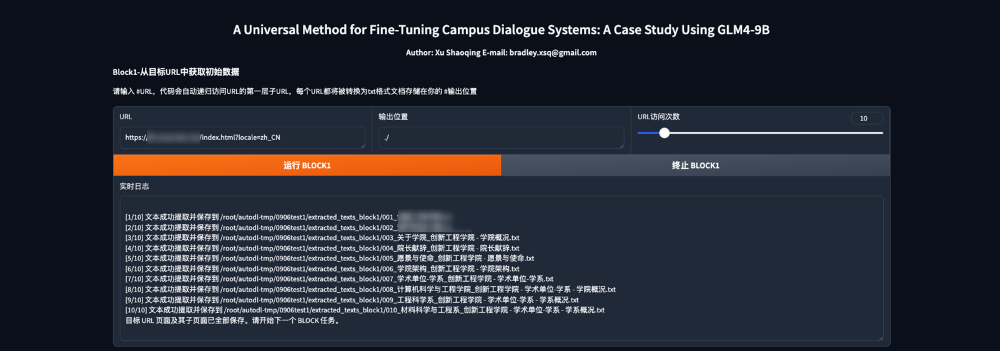
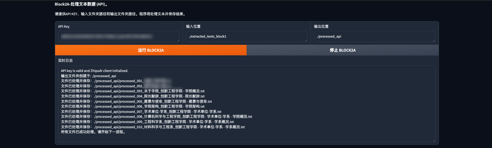
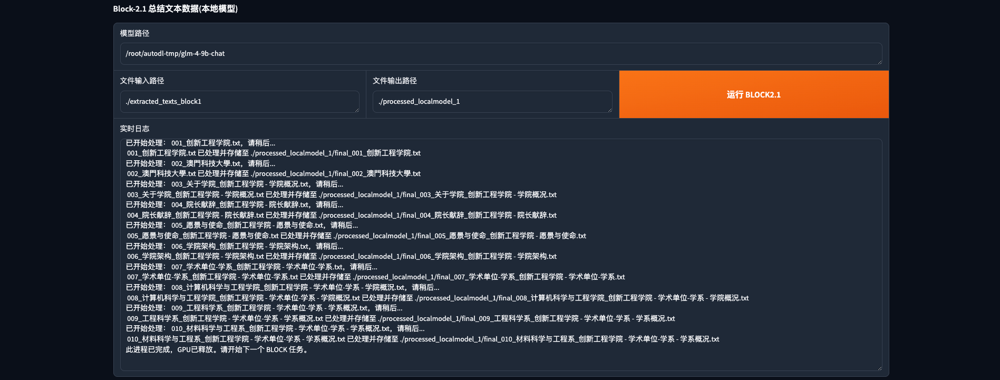
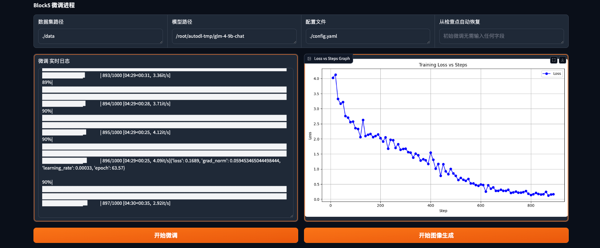

# UMTCDS-Universal Method for Fine-Tuning Campus Dialogue Systems

项目开发基于 THUDM/GLM-4（Copyright 2024 GLM-4-9B Model Team @ Zhipu AI）。

<p align="center">
 📑<a href="#" target="正在撰写"> Report（writing） </a> 
• 🤖 <a href="https://modelscope.cn/models/ZhipuAI/glm-4-9b-chat" target="_blank">ModelScope</a> 
• 🤗 <a href="https://huggingface.co/collections/THUDM/glm-4-665fcf188c414b03c2f7e3b7" target="_blank">HF Repo</a>

</p>
<p align="center">
📍<a href="https://www.autodl.com/home">AutoDL</a> 使用UMTCDS，详细教程<a href="https://www.autodl.com/home"> Click Me</a>
</p>


## 项目版本
- ⏭️ **version-1.0**: ```2024/09/08``` UMTCDS（v-1.0）支持在通用24G显存（或更高）设备进行使用，并上传1.0版本全部代码 
- ⏭️ COMING SOON

## 项目简介
UMTCDS 是一款便于初学者快速进入大模型微调世界的有效框架（工具），基于 Python 及其库 Gradio 开发，旨在提供高效的数据获取、处理，模型可视化微调方案，适用于学术研究和非商业用途。
项目代码仓库分为三部分：便捷sh执行文件、UMTCDS完整执行文件、UMTCDS分块执行文件，可以高效快速进行模型本地部署及微调工作。
本项目遵循 Creative Commons Attribution-NonCommercial-NoDerivatives 4.0 International Public License（CC BY-NC-ND 4.0）。

## 使用指南
项目依托AutoDL平台运行，本地化使用需要修改部分代码，底部有提示。

### 1 准备工作
#### 1.1 安装Git LFS*

```bash
#开启终端后需要执行学术加速指令
source /etc/network_turbo

# 通过指定 URL 下载并执行一个脚本，该脚本会为你的系统配置 Git LFS 的软件源
curl -s https://packagecloud.io/install/repositories/github/git-lfs/script.deb.sh | sudo bash

#使用系统的包管理器安装 Git LFS
sudo apt-get install git-lfs

#配置 Git 以使用 Git LFS 处理大文件。
git lfs install
```

#### 1.2 拉取权重文件*
``` bash
# 进入数据盘存放权重文件
cd autodl-tmp

# HUGGINGFACE
git clone https://huggingface.co/THUDM/glm-4-9b-chat

# 魔塔社区
git clone https://www.modelscope.cn/ZhipuAI/glm-4-9b-chat.git
```

#### 1.3 拉取代码仓库*
``` bash
#在 autodl-tmp 盘下进行克隆
git clone 
``` 

#### 1.4 环境与依赖*
``` bash
# 安装依赖可与拉取权重文件在不同终端同时执行
bash 创建虚拟环境.sh
bash 激活环境.sh
bash 安装依赖.sh
``` 


### 2 运行项目
#### 2.0 快捷执行*
运行后需要在autodl控制台-容器实例-自定义服务中，建立本地6006通道
``` bash
#运行整个UMTCDS
cd UMTCDS
bash  快捷运行.sh

``` 

#### 2.1-BLOCK1 从目标URL获取数据
<strong>⚠️⚠️⚠️获取数据前请先获得网站开发者的许可！</strong>

| URL                                                               |                       输出位置                        | URL访问次数 |
|:------------------------------------------------------------------|:-------------------------------------------------:|:-------:|
| 代码已去除header、footer、cookie等噪声数据<br/>从目标URL遍历整个页面并递归访问<b>1次</b>子URL | 每一个页面都将输出成一个txt文档<br/>自动生成保存的文件夹./extracted_texts | URL总计次数 |



#### 2.2-BLOCK2A 清洗数据（1/2 + 2/2）
BLOCK2A通过智谱AI的GLM-4-flash免费调用进行数据清洗，请先前往<a href="https://bigmodel.cn/">智谱AI</a>获取秘钥。
BLOCK2A运行完成后会自动生成多个问答对txt文件。

| API KEY               |                   输入位置                    |             输出位置             |
|:----------------------|:-----------------------------------------:|:----------------------------:|
| 使用 GLM-4-flash 进行数据清洗 | 从BLOCK1中的./extracted_texts获取数据并可以递归访问子文件夹 | 清洗过后的数据存放路径需手动输入 ./processed |



#### 2.2-BLOCK2.1 清洗数据（1/2）
BLOCK2.1通过本地GLM4-9b-chat模型进行数据清洗，请确保已拉取模型权重文件。

| 模型路径                                       |                文件输入位置==路径                 |             输出路径             | 执行按钮            |
|:-------------------------------------------|:-----------------------------------------:|:----------------------------:|-----------------|
| /root/autodl-tmp/glm-4-9b-chat<br/>模型的绝对路径 | 从BLOCK1中的./extracted_texts<br/>获取数据并可以递归访问子文件夹 | 清洗过后的数据存放路径需手动输入 ./processed | 运行完毕后会自动释放GPU资源 |



#### 2.2-BLOCK2.2 清洗数据（2/2）
BLOCK2.2通过本地GLM4-9b-chat模型进行问答对生成，请确保已拉取模型权重文件。

| 模型路径                                       |                      文件输入路径                      |             输出路径             | 执行按钮            |
|:-------------------------------------------|:------------------------------------------------:|:----------------------------:|-----------------|
| /root/autodl-tmp/glm-4-9b-chat<br/>模型的绝对路径 | 从BLOCK2.1中的./extracted_texts<br/>获取数据并可以递归访问子文件夹 | 清洗过后的数据存放路径需手动输入 ./processed | 运行完毕后会自动释放GPU资源 |


#### 2.3-BLOCK3 生成JSONL数据集
BLOCK2.2通过本地GLM4-9b-chat模型进行问答对生成，请确保已拉取模型权重文件。
三个标准数据集文件名需要填写，可参照样例。拆分比例8：:1：:1

| 文件输入路径                 |        输出路径         |
|:-----------------------|:-------------------:|
| BLOCK2A或者BLOCK2.2的输出路径 | 项目根目录的data   ./data |


#### 2.4-BLOCK4 生成配置文件
BLOCK4采用面板方式，可视化生成微调的配置文件，目前仅支持ptuning v2 方式。


| 数据集名称        |            输出配置            |
|:-------------|:--------------------------:|
| 需与BLOCK3中的一致 | 需要输入文件具体位置   ./config.yaml |


#### 2.5-BLOCK5 微调进程
BLOCK5调用外部UMTCDS_ft.py文件进行微调，请勿删除相关文件。
微调过程实时生成Loss versus Steps的图像，并自动存放在项目根目录中。
点击 <button>开始微调</button> 后，会加载本地GLM-4-9B-CHAT模型，时间大概为20s后有日志输出。
微调开始后点击 <button>开始图像生成</button>，大概1min后，有首个图像生成，可以注意终端的输出：No checkpoints found yet. Waiting... 
运行完毕后，会自动释放GPU资源。

| 数据集路径               | 模型路径 |  配置文件 |       从检查点恢复       |
|:--------------------|------|---|:------------------:|
| 需与BLOCK3中的一致 ./data |  /root/autodl-tmp/glm-4-9b-chat    |  ./config.yaml | 如果没有异常 此处不需要填写任何内容 |




#### 2.6-BLOCK6 推理并校验
如果你的模型位置并没有按照项目要求存放在/root/autodl-tmp/glm-4-9b-chat，则你需要手动修改UMTCDS_ft.py中的模型位置！
如果你成功运行到此，那么祝贺你完成了你的首次 UMTCDS-GLM4-9b的微调工作，希望你再接再厉，将国产大模型衍生出更好的作品！

| 微调后权重路径                                                | 开始推理        | 卸载模型    |      发送      |
|:-------------------------------------------------------|-------------|---------|:------------:|
| 需要精确到详细的checkpoint-xxx位置<br/>./output/checkpoint-10000 | 将会加载你的微调后模型 | 释放GPU资源 | 与你的微调后模型进行对话 |


### 3 本地化部署

- 所有py文件中基于gradio的launch()方法内的主机、端口号等都应去除
- 微调时采用的UMTCDS_ft.py文件内的模型地址需要修改为您的本地路径

##  下一步计划

- 对更多的模型进行适配
- 对可能出现的BUG进行修复
- 敬请期待！

## 友情链接
+ [GLM4](https://github.com/THUDM/GLM-4): GLM-4-9B 是智谱 AI 推出的最新一代预训练模型 GLM-4 系列中的开源版本。 
+ [HUGGINGFACE](https://huggingface.co/THUDM/glm-4-9b-chat):HF中GLM-4-9B的模型权重文件。
+ [魔塔社区](https://modelscope.cn/models/ZhipuAI/glm-4-9b-chat):魔塔社区中GLM-4-9B的模型权重文件。
+ [CSDN 详细教程](#):作者在CSDN中的更加详细的教程，待更新！

## 引用声明
- 本项目中使用了 [GLM4](https://github.com/THUDM/GLM-4) 中GLM-4/basic_demo /trans_web_demo.py、
GLM-4/finetune_demo /finetune.py代码，该部分代码版权：Copyright 2024 GLM-4-9B Model Team @ Zhipu AI
##

## 协议

+ 本开源仓库的代码则遵循 [Creative Commons Attribution-NonCommercial-NoDerivatives 4.0 International Public License](LICENSE) 协议。

请您严格遵循开源协议。

## 引用