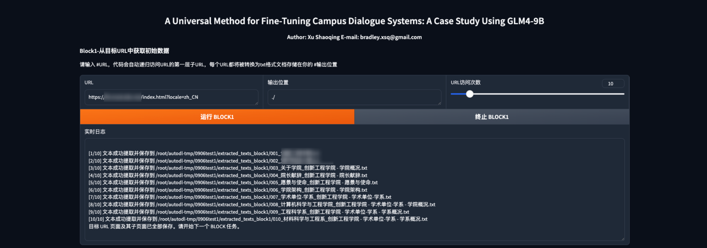
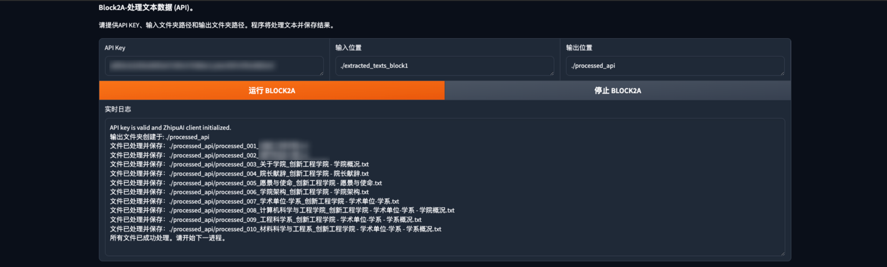
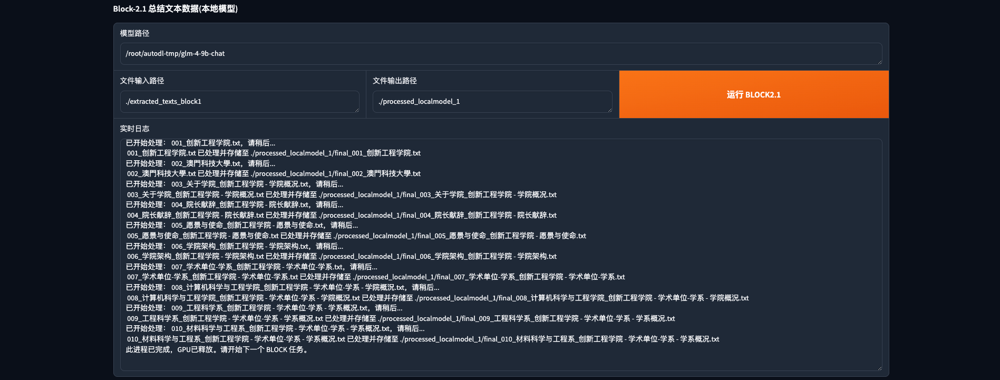
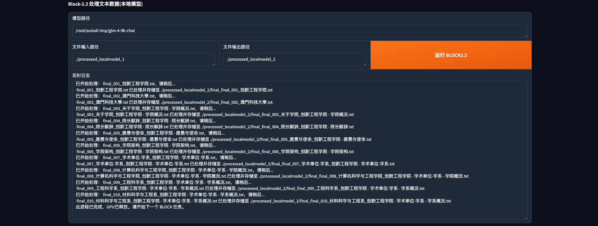
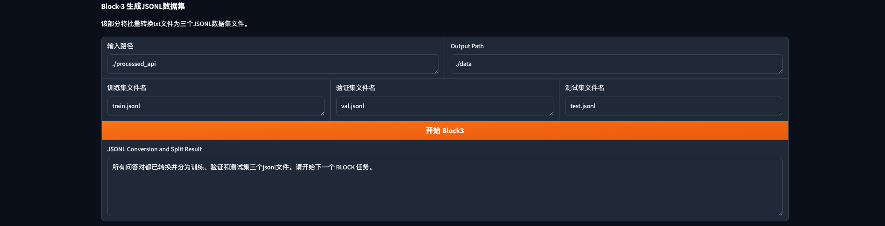
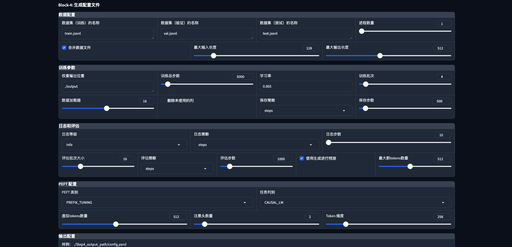
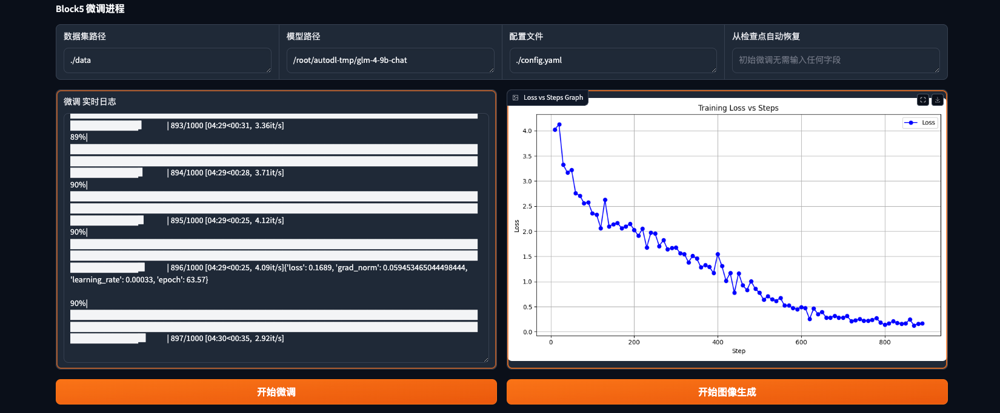
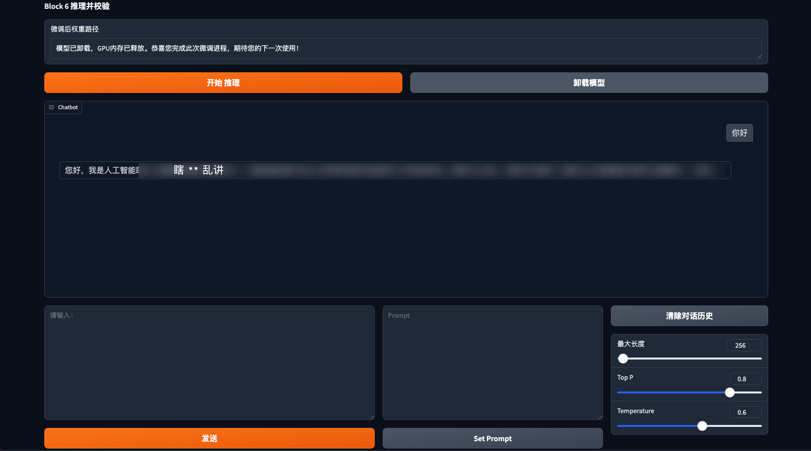

# UMTCDS-Universal Method for Fine-Tuning Campus Dialogue Systems

The project is developed based on THUDM/GLM-4 (Copyright 2024 GLM-4-9B Model Team @ Zhipu AI).

<p align="center">
📑<a href="#" target="Writing"> Report（writing） </a>
• 🤖 <a href="https://modelscope.cn/models/ZhipuAI/glm-4-9b-chat" target="_blank">ModelScope</a>
• 🤗 <a href="https://huggingface.co/collections/THUDM/glm-4-665fcf188c414b03c2f7e3b7" target="_blank">HF Repo</a>

</p>
<p align="center">
📍<a href="https://www.autodl.com/home">AutoDL</a> Using UMTCDS, detailed tutorial <a href="https://www.autodl.com/home"> Click Me</a>
</p>

## Project version
- ⏭️ **version-1.0**: ```2024/09/08``` UMTCDS (v-1.0) supports use on general 24G video memory (or higher) devices, and uploads all the code of version 1.0
- ⏭️ COMING SOON

## Project Introduction
UMTCDS is an effective framework (tool) for beginners to quickly enter the world of large model fine-tuning. It is developed based on Python and its library Gradio, aiming to provide efficient data acquisition, processing, and model visualization fine-tuning solutions, suitable for academic research and non-commercial use.
The project code repository is divided into three parts: convenient sh execution file, UMTCDS complete execution file, and UMTCDS block execution file, which can efficiently and quickly perform local model deployment and fine-tuning.
This project follows Creative Commons Attribution-NonCommercial-NoDerivatives 4.0 International Public License (CC BY-NC-ND 4.0).

## Usage Guide
The project runs on the AutoDL platform. Local use requires modification of some codes, and there are prompts at the bottom.

### 1 Preparation
#### 1.1 Install Git LFS*

```bash
#After opening the terminal, you need to execute the academic acceleration command
source /etc/network_turbo

# Download and execute a script by specifying the URL, which will configure the software source of Git LFS for your system
curl -s https://packagecloud.io/install/repositories/github/git-lfs/script.deb.sh | sudo bash

#Install Git LFS using the system's package manager
sudo apt-get install git-lfs

#Configure Git to use Git LFS to handle large files.
git lfs install
```

#### 1.2 Pull weight files*
``` bash
# Enter the data disk to store weight files
cd autodl-tmp

# HUGGINGFACE
git clone https://huggingface.co/THUDM/glm-4-9b-chat

# Magic Tower Community
git clone https://www.modelscope.cn/ZhipuAI/glm-4-9b-chat.git
```

#### 1.3 Pull code repository*
``` bash
# Clone under autodl-tmp disk
git clone
```

#### 1.4 Environment and dependencies*
``` bash
# Install dependencies and pull weight files at the same time in different terminals
bash Create virtual environment.sh
bash Activate environment.sh
bash Install dependencies.sh
```

### 2 Run project
#### 2.0 Quick Execution*
After running, you need to create a local 6006 channel in the autodl console-container instance-custom service
``` bash
#Run the entire UMTCDS
cd UMTCDS
bash Quick Run.sh

```

#### 2.1-BLOCK1 Get data from the target URL
<strong>⚠️⚠️⚠️Please obtain permission from the website developer before getting data! </strong>

| URL | Output location | URL access times |
|:-----------------------------------------------------------------|:-------------------------------------------------:|:-------:|
| The code has removed noise data such as header, footer, and cookies<br/>Traverse the entire page from the target URL and recursively access <b>1 time</b> the sub-URL | Each page will be output as a txt document<br/>Automatically generate a saved folder./extracted_texts | Total URL times |



#### 2.2-BLOCK2A cleans data (1/2 + 2/2)
BLOCK2A uses GLM-4-flash of Zhipu AI for free to clean data. Please go to <a href="https://bigmodel.cn/">Zhipu AI</a> to obtain the secret key first.
After BLOCK2A runs, it will automatically generate multiple question-answer txt files.

| API KEY | Input location | Output location |
|:----------------------|:-----------------------------------------:|:----------------------------:|
| Use GLM-4-flash for data cleaning | Get data from ./extracted_texts in BLOCK1 and recursively access subfolders | The storage path of cleaned data needs to be manually entered ./processed |



#### 2.2-BLOCK2.1 Cleaning data (1/2)
BLOCK2.1 uses the local GLM4-9b-chat model to clean data. Please make sure that the model weight file has been pulled.

| Model path | File input location == path | Output path | Execute button |
|:-------------------------------------------|:-----------------------------------------:|:----------------------------:|----------------|
| /root/autodl-tmp/glm-4-9b-chat<br/>Absolute path of the model | Get data from ./extracted_texts<br/> in BLOCK1 and recursively access subfolders | The storage path of the cleaned data needs to be manually entered ./processed | GPU resources will be automatically released after the run is completed |



#### 2.2-BLOCK2.2 Cleaning data (2/2)
BLOCK2.2 generates question-answer pairs through the local GLM4-9b-chat model. Please make sure that the model weight file has been pulled.

| Model path | File input path | Output path | Execute button |
|:-------------------------------------------|:------------------------------------------------:|:----------------------------:|----------------|
| /root/autodl-tmp/glm-4-9b-chat<br/>Absolute path of the model | Get data from ./extracted_texts<br/> in BLOCK2.1 and recursively access subfolders | The storage path of the cleaned data needs to be manually entered ./processed | GPU resources will be automatically released after the run is completed |



#### 2.3-BLOCK3 Generate JSONL dataset
BLOCK2.2 generates question-answer pairs through the local GLM4-9b-chat model. Please make sure that the model weight file has been pulled.
The three standard dataset file names need to be filled in, and you can refer to the sample. Split ratio 8: :1: :1

| File input path | Output path |
|:-----------------------|:-------------------:|
| Output path of BLOCK2A or BLOCK2.2 | Data in the project root directory ./data |



#### 2.4-BLOCK4 Generate configuration file
BLOCK4 uses the panel method to visually generate fine-tuning configuration files. Currently, only ptuning v2 method is supported.

| Dataset name | Output configuration |
|:-------------|:--------------------------:|
| Must be consistent with BLOCK3 | Need to enter the specific location of the file ./config.yaml |



#### 2.5-BLOCK5 fine-tuning process
BLOCK5 calls the external UMTCDS_ft.py file for fine-tuning. Please do not delete the related files.
The fine-tuning process generates Loss versus Steps images in real time and automatically stores them in the project root directory.
After clicking <button>Start fine-tuning</button>, the local GLM-4-9B-CHAT model will be loaded, and log output will be generated after about 20 seconds.
After fine-tuning starts, click <button>Start image generation</button>. After about 1 minute, the first image will be generated. You can pay attention to the output of the terminal: No checkpoints found yet. Waiting...
After running, GPU resources will be automatically released.

| Dataset path | Model path | Configuration file | Restore from checkpoint |
|:--------------------|------|---|:------------------:|
| Must be consistent with BLOCK3 ./data | /root/autodl-tmp/glm-4-9b-chat | ./config.yaml | If there is no exception, no need to fill in anything here |



#### 2.6-BLOCK6 Reasoning and verification
If your model location is not stored in /root/autodl-tmp/glm-4-9b-chat as required by the project, you need to manually modify the model location in UMTCDS_ft.py!
If you successfully run to this point, then congratulations on completing your first UMTCDS-GLM4-9b fine-tuning work. I hope you will continue to work hard and derive better works from domestic large models!

| Fine-tuned weight path | Start inference | Unload model | Send |
|:-------------------------------------------------------|-------------|---------|:------------:|
| Need to be accurate to the detailed checkpoint-xxx location<br/>./output/checkpoint-10000 | Will load your fine-tuned model | Release GPU resources | Talk to your fine-tuned model |



### 3 Local deployment

- All hosts and port numbers in the launch() method based on gradio in all py files should be removed
- The model address in the UMTCDS_ft.py file used during fine-tuning needs to be changed to your local path

## Next step

- Adapt more models
- Fix possible BUGs
- Stay tuned!

## Friendly links
+ [GLM4](https://github.com/THUDM/GLM-4): GLM-4-9B is the open source version of the latest generation of pre-trained models in the GLM-4 series launched by Zhipu AI.
+ [HUGGINGFACE](https://huggingface.co/THUDM/glm-4-9b-chat): The model weight file of GLM-4-9B in HF.
+ [Mota Community](https://modelscope.cn/models/ZhipuAI/glm-4-9b-chat): The model weight file of GLM-4-9B in the Mota community.
+ [CSDN Detailed Tutorial](#): The author's more detailed tutorial in CSDN, to be updated!

## Reference Statement
- This project uses the GLM-4/basic_demo /trans_web_demo.py, GLM-4/finetune_demo /finetune.py codes in [GLM4](https://github.com/THUDM/GLM-4), the copyright of this part of the code: Copyright 2024 GLM-4-9B Model Team @ Zhipu AI


## Agreement

+ The code of this open source repository follows the [Creative Commons Attribution-NonCommercial-NoDerivatives 4.0 International Public License](LICENSE) agreement.

Please strictly follow the open source agreement.